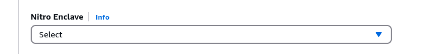

# Event Attestator Nitro

This repository contains the core codebase for the Proofcast event attestation
system.

The purpose of the Event Attestator (EA) is to give its users the ability to prove,
on a destination blockchain B, that events or state changes have occurred on the
origin blockchain A, for any supported blockchain A and B. The proof is provided
as a Trusted Execution Environment (TEE)-backed signature of the event in question.

Currently the Event Attestator supports AWS' Nitro TEE.

## Attestator operation

The EA will provide a signature for any valid event available on the configured blockchains.
Only those events that match the signatures provided in the configuration file will
be signed.
Event data is provided to the EA through compatible rpc endpoints. Currently, these
are:

- `eth_getTransactionReceipt` for EVM-like blockchains.
- `v2/history/get_transaction` for Antelope blockchains.

The event data for a given event is considered reliable when *k of n* of the configured
endpoints agree on its content. Consensus might not be reached, tipically, if a
too-large number of endpoints are currently unreachable for a network request. In
that case, it's sufficient to try the event signing at a later time.

The rpc calls are secured via TLS. By default the EA will use Alpine's certificate
file. EA users can provide their own certificate file, see [configuration](#event-attestator-server-configuration).

## Project structure

- `attestation/`: rust binary crate that provides an interface to Nitro's NSM
- `attestator/`: core attestation logic and server-client architecture
- `scripts/`: bash scripts and Docker configurations necessary to run the attestator

## Running the Event Attestator

### Requirements

#### AWS' Nitro-enabled EC2 instance

In order to launch a new nitro enclave create an Amazon AWS account and select a
location (i.e. N.Virginia). From the dashboard select a suitable machine for the
use of Nitro enclave: the smallest available at the time of writing is `c5.xlarge`.
The preferred operating system is `AL2023`.

Enable nitro in the advanced configuration menu.



For more information about Amazon Nitro check the [official documentation](https://docs.aws.amazon.com/enclaves/latest/user/nitro-enclave.html)

Once the machine is started connect to it using `ssh`.

#### `nitro-cli`

To install the `nitro-cli` follow the [instructions](https://docs.aws.amazon.com/enclaves/latest/user/nitro-enclave-cli-install.html)
on the official documentation.

#### Docker

To install Docker follow the [instructions](https://docs.docker.com/engine/install/)
on the official documentation.

#### Git

To install git follow the [instructions](https://git-scm.com/downloads) on the
official documentation.

#### Python and Pipenv

Running the EA client requires a working installation of Python 3.12.7 and Pipenv.
If the correct python version is unavailable on your machine you can:

- Use `conda` through [miniconda](https://docs.anaconda.com/miniconda/install/),
following the [directions](https://docs.conda.io/projects/conda/en/latest/user-guide/tasks/manage-environments.html)
to create an environment that is Python 3.12.7 enabled.
- Download [Python 3.12.7](https://www.python.org/downloads/release/python-3127/)
and build it from source following the [build instructions](https://github.com/python/cpython/blob/3.12/README.rst#id4)
and the [developer guide](https://devguide.python.org/).

To install [Pipenv](https://pipenv.pypa.io/en/latest/) follow the
[instructions](https://pipenv.pypa.io/en/latest/installation.html) on the official
documentation.

### Event Attestator codebase

Clone the repository with `git clone https://github.com/proofcastlabs/event-attestator-nitro.git`

### Event Attestator Server configuration

The EA needs a toml configuration file that sets the following parameters, for each
supported blockchain:

- `endpoints`: list of rpc endpoints to be used for event data fetching and validation
- `consensus_threshold`: the *k* of the *n* configured endpoints that need to agree
on the event data for it to be considered valid. It's perfectly fine to set
`k = n` and not recommended to set `k < n/2 + 1`.
- `events`: list of filtered events. **Important**: only events that match the filter
for the configured blockchains will be signed. The event format is `[address, topic]`
for EVM events and `[accountName, action]` for EOS events.

See [server_config_example.toml](server_config_example.toml) for an example.

### Running the Event Attestator Server

The EA server can be started with the launcher script located at `scripts/launch_attestator.sh`
The following environment variables can be set to change the behavior of the launcher.

- `ATTESTATOR_CONFIG`: **required**, path to the configuration toml, needs to be
within the project directory tree
- `ATTESTATOR_CERTS`: if set but empty, use the cert file in `scripts/cert.pem`;
if set to path, use that instead; if unset, use Alpine's certificates. Defaults
to unset.
- `ATTESTATOR_CPU_COUNT`: available cpus, defaults to `2`.
- `ATTESTATOR_CID`: server enclave's cid, defaults to `100`. **Important**: this
will impact the ability of the client to connect to the server, if the same change
is not reflected in the client's configuration.
- `ATTESTATOR_MEMORY`: available memory, defaults to `2048`.
- `DEBUG`: if set, start the server enclave in debug mode and connect to its console.
Defaults to unset.

Example invocation:

```bash
DEBUG= ATTESTATOR_CONFIG=./config.toml ./scripts/launch_attestator.sh
```

**Important**: configuration changes will only be effective once the launcher has
been invoked again.

### Event Attestator Client CLI requirements

To interact with the EA client via the CLI, it's necessary to activate a Pipenv
environment with the required dependencies.

Assuming Pipenv's binary is available on your path, (see [requirements](#requirements)),
from the project root, invoke:

```bash
pipenv install --ignore-pipfile
```

### Running the Event Attestator Client CLI

If the EA Server was started with the default environment variables, the EA Client
CLI can be invoked, from the project root, with:

```bash
pipenv run python -m attestator.attestator_client --cid 100 $cmd_and_cmd_args
```

Following is the CLI usage documentation.

```bash
usage: attestator.attestator_client [-h] [-c CID] [--host HOST] [-p PORT] [-d] cmd [cmd_args ...]

positional arguments:
  cmd                   command to pass to the attestator server
  cmd_args              command arguments to pass to the attestator server

options:
  -h, --help            show this help message and exit
  -c CID, --cid CID     enclave cid, ignored in debug mode
  --host HOST           connection host, used in debug mode
  -p PORT, --port PORT  connection port
  -d, --debug           assume the client is connecting to a server started inside a normal docker container
```

Currently, the CLI supports the following commands:

- `ping`: ping the EA server to establish whether it is active.
- `sign-event $chain_id $tx_id`: request the signature of all configuration-compatible
events for the transaction `$tx_id` on the blockchain `$chain_id`; if successful,
returns a list of signed events.
- `get-attestation`: request attestation information, returns `[signignAddress,
signingPubKey, Attestation]`, where `Attestation` is an NSM-backed attestation with
`signingPubKey` and the EA Server configuration content. **Important**: attestation
details are tied to a specific EA Server enclave image, that is to a specific running
enclave instance of a specific docker build. As such, they do not survive EA Server
re-runs and even more so executable or configuration changes. This is by design,
so that, once verified, the attestation certifies that a specific running instance
and, most importantly, its signing key, are as advertised.

### Debugging

The most likely cause for the failure of a `sign-event` request is lack of consensus,
as a result of a too-large number of failed network requests. When that happens,
the CLI will return an error message that will include the content of the network
failure as thrown inside the python library.

In the event that the issue persists:

- If the response features a `Mismatched arguments` issue, the transaction id might
be incorrect, check with a block explorer whether that is the case
- `ssl` issues might be due to an endpoint whose identity was not successfully verified;
if the offending endpoint is trusted, you can provide the EA Server with a `cert.pem`
file (see [above](#running-the-event-attestator-server)) that includes the necessary
certificates.

It is possible to start the EA Server in debug mode, both locally or on a normal
Docker container, for easier debugging. As a Docker container:

```bash
docker build -t attestator -f ./scripts/Dockerfile --build-arg ATTESTATOR_CONFIG=./config.toml  .
docker run --rm -p 8080:8080 attestator pipenv run python -m attestator.attestator_server -d config.toml
```

This can be accessed from the EA Client CLI as:

```bash
pipenv run python -m attestator.attestator_client -d cmd $cmd_and_cmd_args
```

Notes:

- `get-attestation` will not work in debug mode.
- The attestator client can be dockerized as well, but that requires pointing it
to the right Server address, with the right `--host` parameter.
- Make sure that the `consensus_threshold` is not bigger than the number of configured
endpoints for the same blockchain.

### Utilities

- `scripts/clean.sh`:
  - Terminate any running EA Server enclave.
  - Stop vsock proxies.
  - Remove all artifacts (except place-holding `scripts/cert.pem`)
- `scripts/deep_clean.sh`:
  - Call `scripts/clean.sh`
  - **Danger**: "factory reset" Docker. Docker build artifacts tend to persist even
  with thorough pruning. Try this as a last resort to clean up some disk space.
  **Don't use** if you care for anything else that Docker might be doing at the moment.
  Reasonable alternative cleanup routine:

  ```bash
  docker container prune -f
  docker image prune -a -f
  docker system prune -af --volumes
  ```
